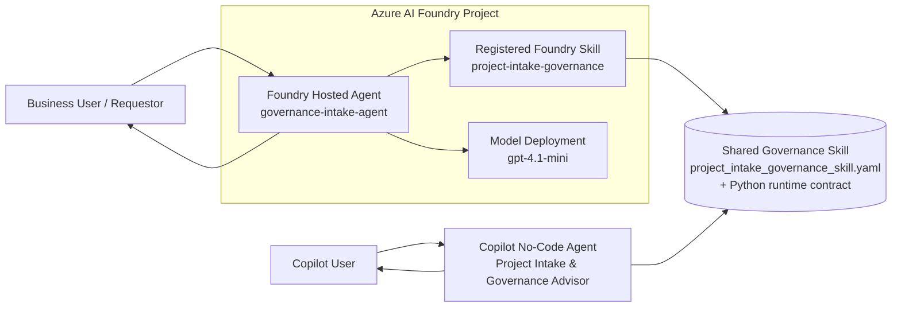

# Shared Governance Skill for Foundry and Copilot Agents

[](https://learn.microsoft.com/azure/developer/azure-developer-cli/)
[](https://learn.microsoft.com/azure/ai-foundry/)
[](https://www.python.org/)

## 🎯 Demo Purpose

This demo shows how **one shared governance Skill** can define intake rules, risk tiering, required reviews, controls, and output contracts **once**—then be reused by:

- a **pro-code Azure AI Foundry hosted agent**, and
- a **no-code Copilot agent**.

The result is consistent governance behavior across both experiences, without duplicating business rules.

## ✨ Why Azure AI Foundry Skills Matter

Azure AI Foundry Skills enable teams to **define a business capability once and reuse it across multiple agents**. In this demo, the shared Skill is the governance source of truth for:

- project intake requirements,
- governance tier classification,
- review and control requirements,
- evaluation expectations, and
- standardized readiness outputs.

That means less drift, less duplicated logic, and a cleaner path to scaling agent experiences across channels.

## 🏗️ Architecture



## 📁 Project Structure

```text
.
├── azure.yaml                                 # azd project definition for the hosted Foundry agent
├── infra/
│   └── main.bicep                            # Minimal azd-compatible infrastructure entry point
├── scripts/
│   └── register_skill.py                     # Registers the shared Skill in Azure AI Foundry
├── skills/
│   ├── project_intake_governance_skill.yaml  # Shared Skill contract and governance tier definitions
│   ├── skill_contract.md                     # Human-readable Skill contract
│   ├── governance_rules.md                   # Governance logic and policy guidance
│   └── evaluation_expectations.md            # Evaluation and review expectations
├── src/
│   └── governance_foundry_agent/
│       ├── main.py                           # Hosted Foundry agent entry point
│       ├── agent.yaml                        # Hosted agent template
│       ├── agent.manifest.yaml               # Foundry agent manifest
│       ├── requirements.txt                  # Python dependencies
│       ├── Dockerfile                        # Container image definition
│       ├── .env.example                      # Local environment variable template
│       └── shared_skill/
│           ├── skill_runtime.py              # Canonical evaluation entry point
│           ├── governance_rules.py           # Tiering, controls, and review logic
│           ├── models.py                     # Pydantic request/response models
│           └── report_renderer.py            # Markdown summary renderer
├── copilot_no_code/
│   ├── README_DEPLOY_COPILOT_GUI.md          # GUI deployment walkthrough for the no-code agent
│   ├── declarative_agent_instructions.md     # Shared governance-aligned instructions
│   ├── conversation_starters.md              # Suggested demo prompts
│   └── governance_checklist.md               # Validation guidance for no-code outputs
├── samples/
│   ├── expected_markdown_summary.md          # Expected demo-ready markdown output
│   ├── expected_skill_response.json          # Expected structured response
│   └── *_request.json                        # Sample intake requests
└── tests/                                    # Pytest suite validating governance rules and contracts
```

## 🤖 How the Foundry Agent Works

The Foundry agent in `src/governance_foundry_agent/main.py` is a pro-code hosted agent built with **agent-framework**:

1. It imports the shared models and runtime from `shared_skill`.
2. It registers `evaluate_governance` as a tool.
3. The tool validates input against `ProjectIntakeRequest`.
4. The shared runtime evaluates the request using centralized governance rules.
5. The agent returns both a structured package and a markdown summary.

This keeps the governance logic in one place while allowing the hosted agent to provide conversational intake and tool-based execution.

## 🧩 How the Copilot Agent Works

The no-code Copilot experience uses declarative instructions that point back to the **same Skill contract and governance rules**. Its instructions explicitly tell the agent to:

- align to the shared request schema,
- apply the same low / medium / high tiering rules,
- return the same 12-field readiness package, and
- avoid inventing alternate governance policies.

This gives you two different user experiences with one governance definition.

## 🚀 Quick Start — Deploy the Foundry Agent

### 1) Prerequisites

- Python 3.13+
- Azure CLI (`az`) — [install](https://learn.microsoft.com/cli/azure/install-azure-cli)
- Azure Developer CLI (`azd`) version `>= 1.25.2` — [install](https://learn.microsoft.com/azure/developer/azure-developer-cli/install-azd)
- Azure subscription with permissions to create AI Services, Container Registry, and Foundry projects
- `pip install azure-ai-projects azure-identity` (for Skill registration)

### 2) Install the Foundry extension

```bash
azd ext install microsoft.foundry
```

### 3) Authenticate

```bash
az login
azd auth login
```

### 4) Create Azure resources

Create the resource group, AI Services account, Foundry project, model deployment, and container registry:

```bash
# Create resource group
az group create --name <rg-name> --location <region>

# Create AI Services account with managed identity
az cognitiveservices account create \
  --name <ai-account-name> --resource-group <rg-name> \
  --location <region> --kind AIServices --sku S0 \
  --custom-domain <ai-account-name>

az cognitiveservices account identity assign \
  --name <ai-account-name> --resource-group <rg-name>

# Create Foundry project (requires managed identity on the AI Services account)
az rest --method PUT \
  --url "https://management.azure.com/subscriptions/<subscription-id>/resourceGroups/<rg-name>/providers/Microsoft.CognitiveServices/accounts/<ai-account-name>/projects/<project-name>?api-version=2025-06-01" \
  --body '{"location":"<region>","identity":{"type":"SystemAssigned"},"properties":{"displayName":"<display-name>"}}'

# Deploy the model
az cognitiveservices account deployment create \
  --name <ai-account-name> --resource-group <rg-name> \
  --deployment-name gpt-4.1-mini --model-name gpt-4.1-mini \
  --model-version 2025-04-14 --model-format OpenAI \
  --sku-capacity 10 --sku-name GlobalStandard

# Create container registry
az acr create --name <acr-name> --resource-group <rg-name> \
  --location <region> --sku Basic --admin-enabled true

# Grant AcrPull to the AI Services managed identity
AI_PRINCIPAL=$(az cognitiveservices account show \
  --name <ai-account-name> --resource-group <rg-name> \
  --query identity.principalId -o tsv)
ACR_ID=$(az acr show --name <acr-name> --resource-group <rg-name> --query id -o tsv)
az role assignment create --assignee-object-id $AI_PRINCIPAL \
  --assignee-principal-type ServicePrincipal --role AcrPull --scope $ACR_ID

# Grant AcrPull to the Foundry project managed identity
PROJECT_PRINCIPAL=$(az rest --method GET \
  --url "https://management.azure.com/subscriptions/<subscription-id>/resourceGroups/<rg-name>/providers/Microsoft.CognitiveServices/accounts/<ai-account-name>/projects/<project-name>?api-version=2025-06-01" \
  --query identity.principalId -o tsv)
az role assignment create --assignee-object-id $PROJECT_PRINCIPAL \
  --assignee-principal-type ServicePrincipal --role AcrPull --scope $ACR_ID
```

### 5) Initialize and configure azd

```bash
azd init --environment <your-env-name>

azd env set AZURE_SUBSCRIPTION_ID <your-subscription-id>
azd env set AZURE_LOCATION <region>
azd env set AZURE_RESOURCE_GROUP <rg-name>
azd env set AZURE_AI_PROJECT_ID /subscriptions/<sub>/resourceGroups/<rg>/providers/Microsoft.CognitiveServices/accounts/<ai-account>/projects/<project>
azd env set FOUNDRY_PROJECT_ENDPOINT https://<ai-account>.services.ai.azure.com/api/projects/<project>
azd env set AZURE_CONTAINER_REGISTRY_ENDPOINT <acr-name>.azurecr.io
azd env set AZURE_AI_MODEL_DEPLOYMENT_NAME gpt-4.1-mini
```

### 6) Register the shared Skill in Foundry

```bash
export FOUNDRY_PROJECT_ENDPOINT=https://<ai-account>.services.ai.azure.com/api/projects/<project>
python scripts/register_skill.py
```

This registers the **Project Intake & Governance Readiness** Skill in your Foundry project. You can verify it in the Foundry portal under **Build → Tools → Skills**.

### 7) Deploy the hosted agent

```bash
azd deploy
```

### 8) Verify

```bash
azd ai agent show
azd ai agent invoke "I want to submit a new AI project for governance review"
```

## 🪄 Quick Start — Configure the Copilot Agent

For the no-code Copilot experience, follow the guided walkthrough in:

`copilot_no_code/README_DEPLOY_COPILOT_GUI.md`

That guide covers both:

- **Copilot Studio** for richer runtime integration, and
- **Agent Builder** for a lighter instructions-first experience.

## 🗣️ Demo Talk Track

Use this narrative for a 3–5 minute customer demo:

1. Start with the business problem: governance logic often gets duplicated across bots, copilots, and custom apps.
2. Open the Foundry portal and show the registered **Skill** under Build → Tools → Skills.
3. Show the Foundry hosted agent and how it calls the shared runtime through `evaluate_governance`.
4. Show the no-code Copilot agent instructions and highlight that they reference the same contract and rules.
5. Close with the key value proposition: **define once, reuse everywhere**.

## ▶️ Suggested Live Demo Flow

1. Open the Foundry portal and show the registered Skill under **Build → Tools → Skills**.
2. Open `skills/project_intake_governance_skill.yaml` and point out the shared input/output contract.
3. Open `src/governance_foundry_agent/main.py` and show the tool registration.
4. Invoke the Foundry hosted agent with a sample project idea.
5. Show the generated readiness package and markdown summary.
6. Open the Copilot no-code deployment guide and explain the alternate user experience.
7. If available, show the Copilot agent producing the same governance outcome for the same request.
8. End by comparing both channels and reinforcing that the business rules were not duplicated.

## 📄 Sample Output

See the expected markdown summary here:

- `samples/expected_markdown_summary.md`

You can also compare the structured output in:

- `samples/expected_skill_response.json`

## ✅ Running Tests

```bash
pip install pydantic pytest && pytest tests/ -v
```

## 🧹 Cleanup

To tear down all provisioned resources:

```bash
azd down
az group delete --name <rg-name> --yes --no-wait
```

## 📌 Important Notes

- All data in this demo is **synthetic**—no real customers, projects, or companies are represented.
- This demo targets **modern Azure AI Foundry projects (Microsoft Foundry)**, not legacy hub-based patterns.
- **Foundry Skills are currently in preview**; this demo uses the `azure-ai-projects` SDK (`beta.skills`) to register the Skill.

## 🤝 Summary

This repository demonstrates a practical pattern for enterprise agent governance: **one shared Skill, multiple agent experiences, consistent outcomes**.
