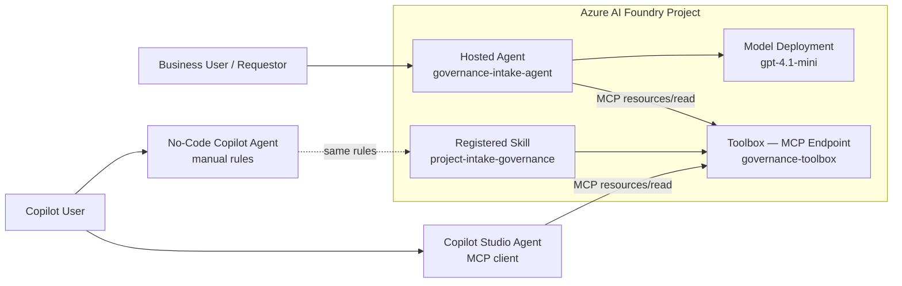

# Shared Governance Skill for Foundry and Copilot Agents

[](https://learn.microsoft.com/azure/developer/azure-developer-cli/)
[](https://learn.microsoft.com/azure/ai-foundry/)
[](https://www.python.org/)

## 🎯 Demo Purpose

This demo shows how **one shared governance Skill** can define intake rules, risk tiering, required reviews, controls, and output contracts **once**—then be consumed by multiple agents through a **Foundry Toolbox (MCP endpoint)**:

- a **pro-code Azure AI Foundry hosted agent** (discovers the Skill via Toolbox MCP at runtime),
- a **Copilot Studio agent** (connects to the same Toolbox MCP endpoint), and
- a **no-code Copilot agent** (uses the same governance rules manually).

The result is consistent governance behavior across all experiences, without duplicating business rules.

## ✨ Why Azure AI Foundry Skills Matter

Azure AI Foundry Skills enable teams to **define a business capability once and reuse it across multiple agents**. When published to a **Toolbox**, any MCP-compatible client can discover and consume the Skill — no custom SDK integration required. In this demo, the shared Skill is the governance source of truth for:

- project intake requirements,
- governance tier classification,
- review and control requirements,
- evaluation expectations, and
- standardized readiness outputs.

That means less drift, less duplicated logic, and a cleaner path to scaling agent experiences across channels.

## 🏗️ Architecture



## 📁 Project Structure

```text
.
├── azure.yaml                                 # azd project definition for the hosted Foundry agent
├── infra/
│   └── main.bicep                            # Minimal azd-compatible infrastructure entry point
├── docs/
│   └── DEMO_TALK_TRACK.md                    # Demo talk track and suggested live demo flow
├── scripts/
│   └── register_skill.py                     # Registers the shared Skill in Azure AI Foundry
├── skills/
│   ├── project_intake_governance_skill.yaml  # Shared Skill contract and governance tier definitions
│   ├── skill_contract.md                     # Human-readable Skill contract
│   ├── governance_rules.md                   # Governance logic and policy guidance
│   └── evaluation_expectations.md            # Evaluation and review expectations
├── src/
│   └── governance_foundry_agent/
│       ├── main.py                           # Hosted Foundry agent entry point
│       ├── agent.yaml                        # Hosted agent template
│       ├── agent.manifest.yaml               # Foundry agent manifest
│       ├── requirements.txt                  # Python dependencies
│       ├── Dockerfile                        # Container image definition
│       ├── .env.example                      # Local environment variable template
│       └── shared_skill/
│           ├── skill_runtime.py              # Canonical evaluation entry point
│           ├── governance_rules.py           # Tiering, controls, and review logic
│           ├── models.py                     # Pydantic request/response models
│           └── report_renderer.py            # Markdown summary renderer
├── copilot_no_code/
│   ├── README_DEPLOY_COPILOT_GUI.md          # GUI deployment walkthrough for the no-code agent
│   ├── declarative_agent_instructions.md     # Shared governance-aligned instructions
│   ├── conversation_starters.md              # Suggested demo prompts
│   └── governance_checklist.md               # Validation guidance for no-code outputs
├── samples/
│   ├── expected_markdown_summary.md          # Expected demo-ready markdown output
│   ├── expected_skill_response.json          # Expected structured response
│   └── *_request.json                        # Sample intake requests
└── tests/                                    # Pytest suite validating governance rules and contracts
```

## 🤖 How the Foundry Agent Works

The Foundry agent in `src/governance_foundry_agent/main.py` is a pro-code hosted agent built with **agent-framework**:

1. At startup, it connects to the **Foundry Toolbox MCP endpoint** (`governance-toolbox`).
2. It discovers the `project-intake-governance` Skill via MCP `resources/list`.
3. It downloads the Skill content via `resources/read` and injects it into the agent's system prompt.
4. It registers `evaluate_governance` as a local Python tool for deterministic execution.
5. The LLM follows the Skill's behavioral instructions; the Python module executes the governance logic.

If the Toolbox is unreachable (e.g., during local development), the agent falls back to bundled instructions.

## 🧩 How the Copilot Agent Works

The no-code Copilot experience uses declarative instructions that reference the **same governance rules** from the Skill. Because the Toolbox is a standard MCP endpoint, Copilot Studio can also connect to it directly. The instructions tell the agent to:

- align to the shared request schema,
- apply the same low / medium / high tiering rules,
- return the same 12-field readiness package, and
- avoid inventing alternate governance policies.

This gives you multiple user experiences with one governance definition.

## 🚀 Quick Start — Deploy the Foundry Agent

### 1) Prerequisites

- Python 3.13+
- Azure CLI (`az`) — [install](https://learn.microsoft.com/cli/azure/install-azure-cli)
- Azure Developer CLI (`azd`) version `>= 1.25.2` — [install](https://learn.microsoft.com/azure/developer/azure-developer-cli/install-azd)
- Azure subscription with permissions to create AI Services, Container Registry, and Foundry projects
- `pip install azure-ai-projects azure-identity` (for Skill registration)

### 2) Install the Foundry extension

```bash
azd ext install microsoft.foundry
```

### 3) Authenticate

```bash
az login
azd auth login
```

### 4) Create Azure resources

Create the resource group, AI Services account, Foundry project, model deployment, and container registry:

```bash
# Create resource group
az group create --name <rg-name> --location <region>

# Create AI Services account with managed identity
az cognitiveservices account create \
  --name <ai-account-name> --resource-group <rg-name> \
  --location <region> --kind AIServices --sku S0 \
  --custom-domain <ai-account-name>

az cognitiveservices account identity assign \
  --name <ai-account-name> --resource-group <rg-name>

# Create Foundry project (requires managed identity on the AI Services account)
az rest --method PUT \
  --url "https://management.azure.com/subscriptions/<subscription-id>/resourceGroups/<rg-name>/providers/Microsoft.CognitiveServices/accounts/<ai-account-name>/projects/<project-name>?api-version=2025-06-01" \
  --body '{"location":"<region>","identity":{"type":"SystemAssigned"},"properties":{"displayName":"<display-name>"}}'

# Deploy the model
az cognitiveservices account deployment create \
  --name <ai-account-name> --resource-group <rg-name> \
  --deployment-name gpt-4.1-mini --model-name gpt-4.1-mini \
  --model-version 2025-04-14 --model-format OpenAI \
  --sku-capacity 10 --sku-name GlobalStandard

# Create container registry
az acr create --name <acr-name> --resource-group <rg-name> \
  --location <region> --sku Basic --admin-enabled true

# Grant AcrPull to the AI Services managed identity
AI_PRINCIPAL=$(az cognitiveservices account show \
  --name <ai-account-name> --resource-group <rg-name> \
  --query identity.principalId -o tsv)
ACR_ID=$(az acr show --name <acr-name> --resource-group <rg-name> --query id -o tsv)
az role assignment create --assignee-object-id $AI_PRINCIPAL \
  --assignee-principal-type ServicePrincipal --role AcrPull --scope $ACR_ID

# Grant AcrPull to the Foundry project managed identity
PROJECT_PRINCIPAL=$(az rest --method GET \
  --url "https://management.azure.com/subscriptions/<subscription-id>/resourceGroups/<rg-name>/providers/Microsoft.CognitiveServices/accounts/<ai-account-name>/projects/<project-name>?api-version=2025-06-01" \
  --query identity.principalId -o tsv)
az role assignment create --assignee-object-id $PROJECT_PRINCIPAL \
  --assignee-principal-type ServicePrincipal --role AcrPull --scope $ACR_ID
```

### 5) Initialize and configure azd

```bash
azd init --environment <your-env-name>

azd env set AZURE_SUBSCRIPTION_ID <your-subscription-id>
azd env set AZURE_LOCATION <region>
azd env set AZURE_RESOURCE_GROUP <rg-name>
azd env set AZURE_AI_PROJECT_ID /subscriptions/<sub>/resourceGroups/<rg>/providers/Microsoft.CognitiveServices/accounts/<ai-account>/projects/<project>
azd env set FOUNDRY_PROJECT_ENDPOINT https://<ai-account>.services.ai.azure.com/api/projects/<project>
azd env set AZURE_CONTAINER_REGISTRY_ENDPOINT <acr-name>.azurecr.io
azd env set AZURE_AI_MODEL_DEPLOYMENT_NAME gpt-4.1-mini
```

### 6) Register the Skill and publish the Toolbox

```bash
export FOUNDRY_PROJECT_ENDPOINT=https://<ai-account>.services.ai.azure.com/api/projects/<project>
python scripts/register_skill.py
```

This does two things:
1. Registers the **Project Intake & Governance Readiness** Skill (visible under **Build → Tools → Skills**).
2. Publishes it to a **Toolbox** called `governance-toolbox` (visible under **Build → Tools → Toolboxes**).

The Toolbox exposes the Skill as an MCP endpoint that any agent can connect to.

### 7) Deploy the hosted agent

```bash
azd deploy
```

### 8) Verify

```bash
azd ai agent show
azd ai agent invoke "I want to submit a new AI project for governance review"
```

## 🪄 Quick Start — Configure the Copilot Agent

For the no-code Copilot experience, follow the guided walkthrough in [copilot_no_code/README_DEPLOY_COPILOT_GUI.md](copilot_no_code/README_DEPLOY_COPILOT_GUI.md).

That guide covers both:

- **Copilot Studio** for richer runtime integration (can connect to the Toolbox MCP endpoint directly), and
- **Agent Builder** for a lighter instructions-first experience.

## 🗣️ Demo Talk Track

See [docs/DEMO_TALK_TRACK.md](docs/DEMO_TALK_TRACK.md) for the full talk track, suggested live demo flow, and sample output references.

## ✅ Running Tests

```bash
pip install pydantic pytest && pytest tests/ -v
```

## 🧹 Cleanup

To tear down all provisioned resources:

```bash
azd down
az group delete --name <rg-name> --yes --no-wait
```

## 📌 Important Notes

- All data in this demo is **synthetic**—no real customers, projects, or companies are represented.
- This demo targets **modern Azure AI Foundry projects (Microsoft Foundry)**, not legacy hub-based patterns.
- **Foundry Skills and Toolboxes are currently in preview**; this demo uses `beta.skills` and `beta.toolboxes` from the `azure-ai-projects` SDK.
- The Toolbox MCP endpoint requires the `Foundry-Features: Toolboxes=V1Preview` header.

## 🤝 Summary

This repository demonstrates a practical pattern for enterprise agent governance: **one shared Skill, published to a Toolbox, consumed by multiple agents via MCP — consistent outcomes everywhere**.
